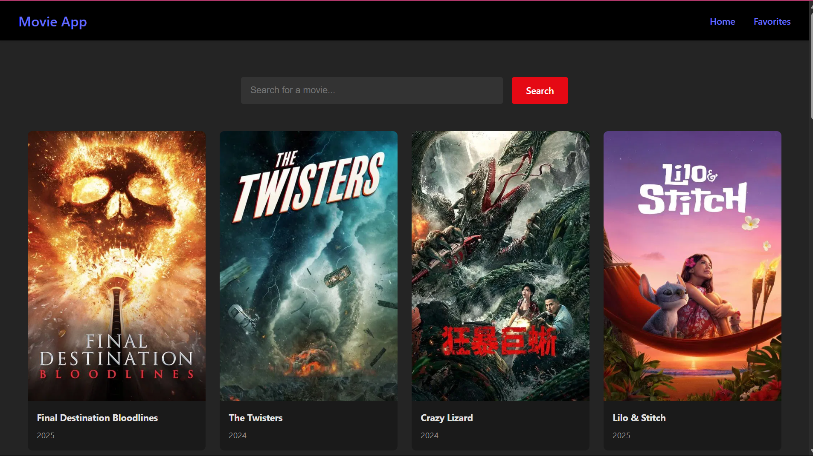

# MOVIE CATLOG

A simple React app to browse and search for movies. Built with [Vite](https://vitejs.dev/) for fast development and hot module replacement.

## Features

- Browse a catalog of movies
- Search movies by title
- Responsive and modern UI

## Screenshot



## Getting Started

1. **Install dependencies:**
   ```sh
   npm install
   ```

2. **Run the development server:**
   ```sh
   npm run dev
   ```

3. **Open your browser:**  
   Visit [http://localhost:5173](http://localhost:5173)

## Build for Production

```sh
npm run build
```

## Technologies Used

- React
- Vite
- CSS/SCSS

## License

This project is licensed under the MIT License.
